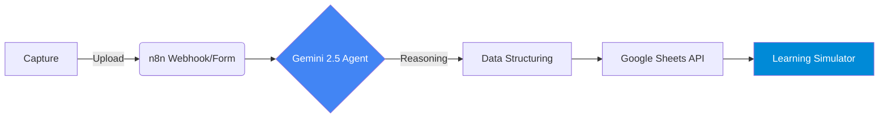

# 🎓 AI-Powered AZ-104 Exam Processor & Simulator

## 📖 Overview

Este proyecto nace para eliminar el "cuello de botella" cognitivo durante la preparación de la certificación **AZ-104 (Azure Administrator)**. Utilizando principios de **AI-Ops**, he desarrollado una pipeline que transforma capturas de pantalla de exámenes en una base de datos de conocimiento estructurada.

La solución integra **Computer Vision** y **LLMs (Gemini 2.5 Flash)** para realizar un análisis profundo de escenarios de Azure, categorizar distractores y mapear referencias a la documentación oficial de Microsoft Learn.

## 🏗️ Architecture & Workflow

El flujo sigue un modelo de procesamiento asíncrono y multimodal:

### 🧠 Capacidades de la IA (Prompt Engineering)

El agente actúa como un **Senior Azure Solutions Architect** realizando:

1. **Identificación de Recursos**: Desglose de componentes (VNets, NSGs, RBAC, etc.).
2. **Análisis Lógico**: Explicación de dependencias técnicas y reglas de negocio.
3. **Análisis de Distractores**: Justificación de por qué las opciones incorrectas no aplican.
4. **Validación**: Enlaces y conceptos basados en documentación oficial.

## 🚀 Guía de Instalación

1. **Importación**: Carga el archivo `az-104-ai-exam-processor.json` en tu n8n.
2. **Credenciales**: Configura tus APIs para **Google Gemini** (via AI Studio) y **Google Sheets** (OAuth2).
3. **Setup de Persistencia**: Crea una Google Sheet con los encabezados: `Date`, `Question_File`, `Explanation`.
4. **Sanitización**: En el nodo final, reemplaza el `Spreadsheet ID` por el de tu propia hoja.

## 📊 Impacto & Resultados

- **Eficiencia**: Reducción del tiempo de corrección manual de 5 min a <15 seg.
- **Calidad**: Análisis consistente basado en el estado del arte de Azure.
- **SOP Compliance**: Este flujo está documentado bajo el estándar `SOP-CLOUD-AZ-03` en mi [Librería de Estándares](https://github.com/daniel-zamo/ops-standards-library).

---
*Hecho con ❤️ por un DevOps Engineer que prefiere automatizar que repetir.*
